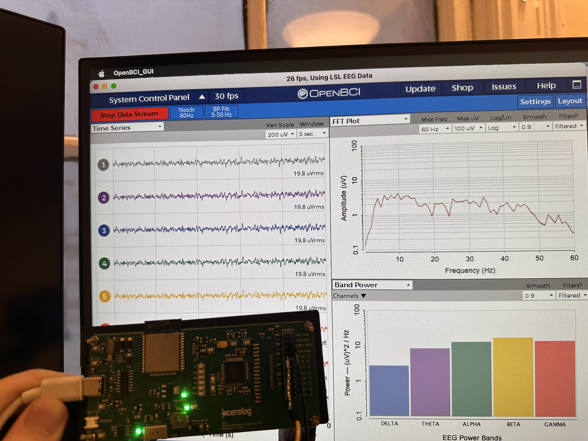

# Cerelog ESP-EEG 

www.cerelog.com

Need Help or have a question? [Discord Chat Community](https://discord.gg/2wXQW3Uy4d)

High-precision 8-channel biosensing board designed for EEG, EMG, ECG, and Brain Computer Interface (BCI) research applications.

# Helpful Links

Contact: simon@cerelog.com

Need Help or have a question? [Discord Chat Community](https://discord.gg/2wXQW3Uy4d)

Product Page: [Here](https://www.cerelog.com/eeg_researchers.html)

Product Usage Guide : [Here](https://www.cerelog.com/eeg_researchers_guide.html)

Video Product Overview: [Here](youtube.com/watch?v=6XKdIbguI00&embeds_referring_euri=https%3A%2F%2Fwww.cerelog.com%2F)

# Why Cerelog's ESP-EEG? 

## 📉 Superior Noise Reduction (Closed-Loop Bias)
Unlike many consumer EEG devices that use "open-loop" or passive grounding strategies, the ESP EEG implements a **True Closed-Loop Active Bias** (Drive Right Leg).

*   **The Problem:** Many competitors leave the bias feedback loop open, rendering the noise cancellation ineffective against movement artifacts and 50/60Hz hum. Their bias pin effectively becomes the average of the supply rails and acts as a ground on their device making the bias pin not function as effectively intended on the ADS1299 datasheet.
*   **Our Solution:** We utilize the full capability of the ADS1299 to measure the common-mode signal, invert it, and actively drive it back into the body.
*   **The Result:** A significantly lower noise floor and fewer artifacts, allowing for research-grade data capture even in non-shielded environments.

# Easy to use Software compatability:

## Compatable **OpenBCI Gui (Custom fork)** with  **Lab Streaming layer (LSL)** 

Setup instructions:  [Here](https://github.com/Cerelog-ESP-EEG/How-to-use-OpenBCI-GUI-fork)

A modified OpenBCI Gui has been forked above so you can visualize data easily and stream to other platforms. This works with it's LSL streaming capability via a special python script (in link above)!

ESP-EEG’s Python client software can stream data via the standard neuroscience software communication protocol Lab Streaming Layer. This means you can stream  directly to your favorite neuroscience software or Matlab running on your laptop or remote computers, record data streams, and integrate ESP-EEG's data with other data streams.

# Stream data to Brainflow API for complex data analysis :

Instructions on how to collect data from device with Brainflow API custom instance: [Here](https://www.cerelog.com/eeg_researchers_guide.html)

and

Custom instance of Brainflow Repo: [Here](https://github.com/shakimiansky/Shared_brainflow-cerelog) for collecting data with the device. 

(Note: Test script to view plot and aquire data -> ( Shared_brainflow-cerelog/python_package/cerelog_tests/filtered_plot.py ) from in above repo. Must download full Brainflow instance to use

# Hardware Overview

View hardware folder for device schematic

## 🔌 Hardware Pinout & Indicators
*   **Status LED (GPIO 17):**
    *   🟢 **Solid On:** Firmware loaded, ready to stream.
    *   ⚫ **Off:** Board not powered or boot failure.
*   **Battery LED:**
    *   🔴 **Red:** Charging.
    *   🟢 **Green:** Fully Charged.
*   **Battery Connector:** JST-PH 2.0mm (Red = +, Black = -). *Supports 3.7V LiPo.*
*   **Electrodes:** Standard touch-proof headers. (Pins 1-8 = Signal, SRB1 = Reference).
## ⚡ Technical Specifications
| Feature | Specification |
| :--- | :--- |
| **ADC** | Texas Instruments ADS1299 (24-bit, Research Grade) |
| **Channels** | 8 Differential Channels + 1 Active Bias (Noise Cancellation) |
| **Sample Rate** | 250 SPS (Default)  |
| **Processor** | ESP32-WROOM-DA (Dual Core, WiFi/BT capable) |
| **Connectivity** | USB-C (Data/Power) & WiFi/Bluetooth (Hardware Ready) |
| **Montage** | Referential (SRB1 = Ref) by default. Configurable to Sequential. See firmware folder for more information|

# Firmware

View firmware folder for firmware and modification instructions

# ⚠️ CRITICAL SAFETY WARNING
**NON-ISOLATED DEVICE: BATTERY OPERATION REQUIRED**

This device **does not** contain galvanic isolation circuitry. To ensure user safety and prevent ground loops:
1.  **ALWAYS** use this device with a laptop running on **BATTERY POWER**.
2.  **NEVER** connect this device to a computer that is plugged into a wall outlet (Mains Power).
3.  **NEVER** use this device on a desktop computer.

Failure to follow these instructions introduces a risk of electric shock in the event of a mains surge and will significantly degrade signal quality due to ground noise.

# Important Notice
This product is intended for research, engineering, and educational purposes only. It is not a medical device and has not been evaluated by the FDA. The product is not UL or FCC certified.

This evaluation board/kit is intended for use for ENGINEERING DEVELOPMENT, DEMONSTRATION, OR EVALUATION PURPOSES ONLY and is not considered by Cerelog Inc. to be a finished end-product fit for general consumer use.

We expressly disclaim any liability whatsoever for any direct, indirect, consequential, incidental or special damages, including, without limitation, lost revenues, lost profits, losses resulting from business interruption or loss of data, arising from the use of this product.

Only plug this device into a computer running off of battery power such as a Laptop running on its own battery supply or a raspberry pi powered by a portable battery bank. Do not connect to a mains powered device such as a PC because it is not isolated in the event of a power surge. 

Cerelog Inc. assumes no liability for the performance, suitability, or use of any third-party products linked or recommended on this website.

